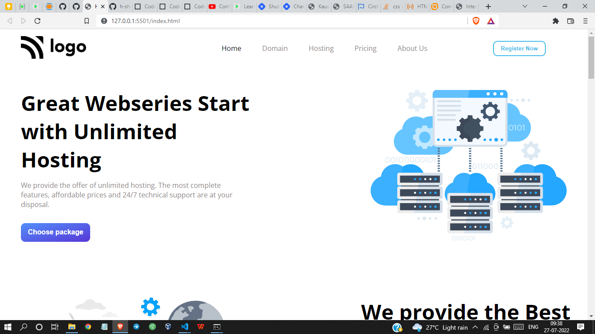

# Project 11 - HTML  and CSS 

By Shreesha

Here's the Live Deployed Website of 

## Project 11  [DEPLOYED LINK](https://project11-hosting-landing-page.netlify.app/)

# What did I learn in this project

- This project took the maximum time compared to all other projects.
- I got to learn about the linear gradient.
- I got to learn about the positioning of containers. 
- Got to learn about the flexbox.

## Time taken to complete project is 9 hours
